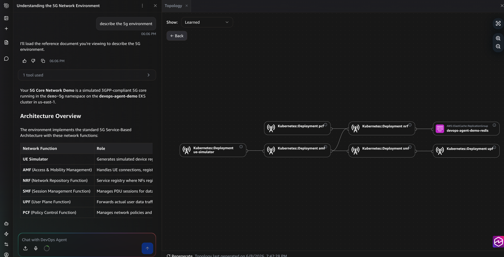

# Introduction

## What is a 5G Core Network?

A 5G Core (5GC) is the brain of a mobile network. Unlike previous generations that ran on purpose-built hardware, 5G Core is designed as cloud-native microservices — making Kubernetes the natural deployment platform. Each service is called a **Network Function (NF)**.

### Network Functions in This Demo

| NF | Full Name | What It Does |
|----|-----------|--------------|
| **NRF** | Network Repository Function | Service registry — every NF registers here so others can discover it. Think of it as the DNS of the 5G core. Uses Redis as its backend store. |
| **AMF** | Access and Mobility Management Function | Front door for subscribers. Handles device registration, authentication, and mobility (handovers between cell towers). |
| **SMF** | Session Management Function | Sets up data sessions (PDU sessions) so subscribers can access the internet or private networks. |
| **UPF** | User Plane Function | The data plane — actual packet forwarding. Routes subscriber traffic based on rules from SMF. |
| **PCF** | Policy Control Function | Policy engine — decides QoS levels, data caps, and network slicing rules for each session. |

### Key Terminology

| Term | Meaning |
|------|---------|
| **SUPI** | Subscription Permanent Identifier — the unique ID for a subscriber (like a phone number but for the core) |
| **PDU Session** | Protocol Data Unit Session — a data connection between a device and the network |
| **S-NSSAI** | Single Network Slice Selection Assistance Information — identifies which "slice" of the network a session belongs to |
| **DNN** | Data Network Name — where traffic exits (e.g., "internet", "enterprise-vpn") |
| **5QI** | 5G QoS Identifier — quality-of-service level (1=voice, 9=best-effort internet) |
| **Nnrf, N11, N4** | Reference points — the interfaces between NFs (Nnrf = anything talking to NRF, N11 = AMF↔SMF, N4 = SMF↔UPF) |

### Architecture

```
┌──────────────────────────────────────────────────────────────────────────┐
│                         5G Core (demo-5g namespace)                       │
│                                                                          │
│                              ┌─────────┐                                 │
│                  ┌───────────│   NRF   │───────────┐                     │
│                  │           │ Registry│           │                     │
│                  │           └────┬────┘           │                     │
│                  │ Nnrf      Nnrf │          Nnrf  │                     │
│                  │                │                │                     │
│      ┌───────────▼──┐        ┌───▼────┐      ┌───▼────┐    ┌────────┐  │
│      │     AMF      │──N11──▶│  SMF   │      │  PCF   │    │   UE   │  │
│      │              │        │        │      │ Policy │    │Simulator│  │
│      │ Registration │        │Session │      └────────┘    │ (load) │  │
│      │ & Mobility   │        │ Mgmt   │                    └───┬────┘  │
│      └──────────────┘        └───┬────┘                        │       │
│              ▲                    │ N4                     N1/N2│       │
│              │                ┌───▼────┐                       │       │
│              │                │  UPF   │                       │       │
│              └────────────────│  Data  │◀──────────────────────┘       │
│                               │ Plane  │                               │
│                               └────────┘                               │
└──────────────────────────────────────────────────────────────────────────┘
                    │
                    ▼
          ElastiCache Redis (NRF backend)
```

**How a subscriber connects:**
1. Device (UE) sends registration request → **AMF**
2. AMF discovers SMF via **NRF** (Redis lookup)
3. AMF requests PDU session from **SMF**
4. SMF fetches policy from **PCF**, installs forwarding rules on **UPF**
5. Subscriber has connectivity

When any link in this chain breaks — NRF can't reach Redis, AMF can't find SMF, UPF doesn't get rules — subscribers lose service. That's what our scenarios exploit.

### What's Real vs. Stubbed

These are **Python stub NFs** that speak the correct 3GPP vocabulary and use real AWS dependencies (ElastiCache Redis for NRF state, SQS for async processing). They are not a production 5G core. What IS real:

- The AWS infrastructure (EKS, Redis, SQS, VPC, Security Groups)
- The failure modes and cascading dependencies
- The logs, metrics, and CloudTrail events the agent investigates
- The troubleshooting path an engineer would follow

---

## What is AWS DevOps Agent?

AWS DevOps Agent is an AI-powered operations assistant that investigates incidents across your AWS environment. Instead of manually correlating logs, metrics, events, and configuration changes, you describe the problem and the agent traces it end-to-end.

### What It Connects To

| Source | What It Sees |
|--------|-------------|
| **EKS / Kubernetes API** | Pods, deployments, events, HPA, node status |
| **CloudWatch Logs** | Application logs, EKS control plane audit logs |
| **CloudWatch Metrics** | Container Insights, node/pod CPU/memory, custom metrics |
| **CloudTrail** | API calls — who changed what, when, from where |
| **Topology** | Resource relationships (pod → node → ASG → instance → SG → Redis) |

### How It Investigates



You give it a symptom: *"AMF pods are failing."* It then:

1. Checks pod status and events
2. Reads application logs for error patterns
3. Follows the dependency chain (AMF → NRF → Redis)
4. Inspects infrastructure (Security Groups, node capacity, ASG limits)
5. Correlates with CloudTrail to identify WHO made a change
6. Reports the full causal chain with timestamps and evidence

No runbooks. No predefined playbooks. It reasons through the problem.

---

## Why DevOps Agent for 5G / Telco

Telco networks running on Kubernetes have a unique operational challenge: **the blast radius of a single infrastructure change is measured in subscribers, not requests.**

A Security Group change that blocks Redis doesn't just return 500s — it takes down the entire NRF service registry, which cascades to every NF that depends on service discovery. Within seconds, millions of subscribers can't register, hand over, or establish data sessions.

Traditional monitoring tells you *what* broke. DevOps Agent tells you *why* it broke and *who* broke it — in minutes instead of hours.

### The Cross-Layer Problem

Telco NOC engineers are experts in their layer:
- **Radio engineers** understand RAN and handovers
- **Core engineers** understand NF interactions and 3GPP signaling
- **Platform engineers** understand Kubernetes and AWS infrastructure

But failures don't respect these boundaries. A pod scheduling issue (platform layer) manifests as subscriber registration timeouts (core layer). An IAM change (cloud layer) causes policy fetch failures (NF layer). DevOps Agent operates across all layers simultaneously — it doesn't need to be a 3GPP expert to trace a Redis connection failure from pod logs through Security Groups to a CloudTrail event.

### What This Demo Proves

Each scenario demonstrates a different cross-layer correlation:

| Scenario | Symptom Layer | Root Cause Layer | Agent Crosses |
|----------|--------------|-----------------|---------------|
| 1. SG Change | Application (NRF logs) | Infrastructure (VPC Security Group) | K8s → AWS networking → CloudTrail |
| 2. ASG Ceiling | Kubernetes (Pending pods) | AWS compute (Auto Scaling Group) | Scheduler → node capacity → ASG config |
| 3. Bad Deploy | Kubernetes (ImagePullBackOff) | CI/CD (deployment change) | Pod events → EKS audit logs → user identity |
| 4. Scaling Storm | Application (intermittent failures) | Configuration (HPA parameters) | Metrics → HPA spec → feedback loop analysis |

This is the value: **faster mean-time-to-resolution for incidents that span operational boundaries.**
