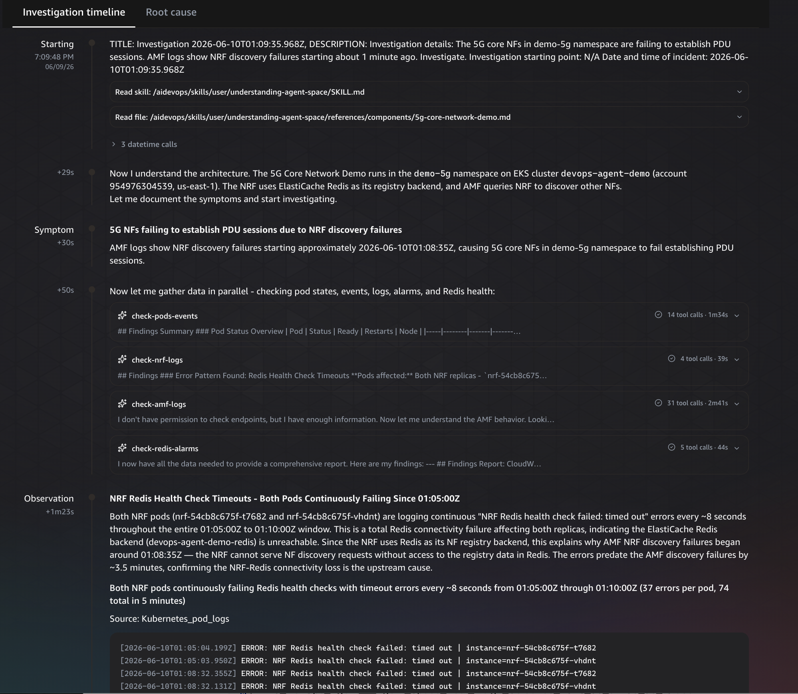
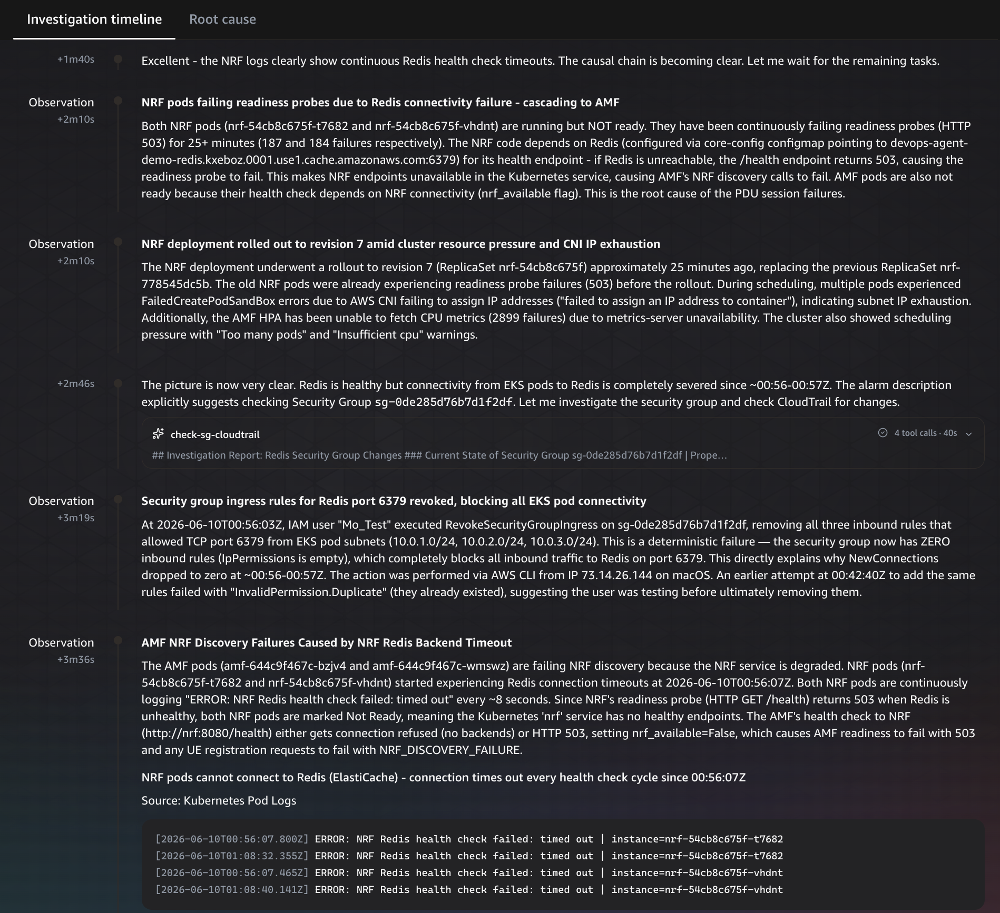
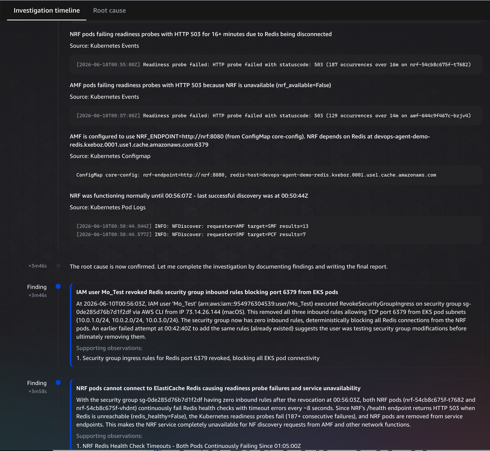
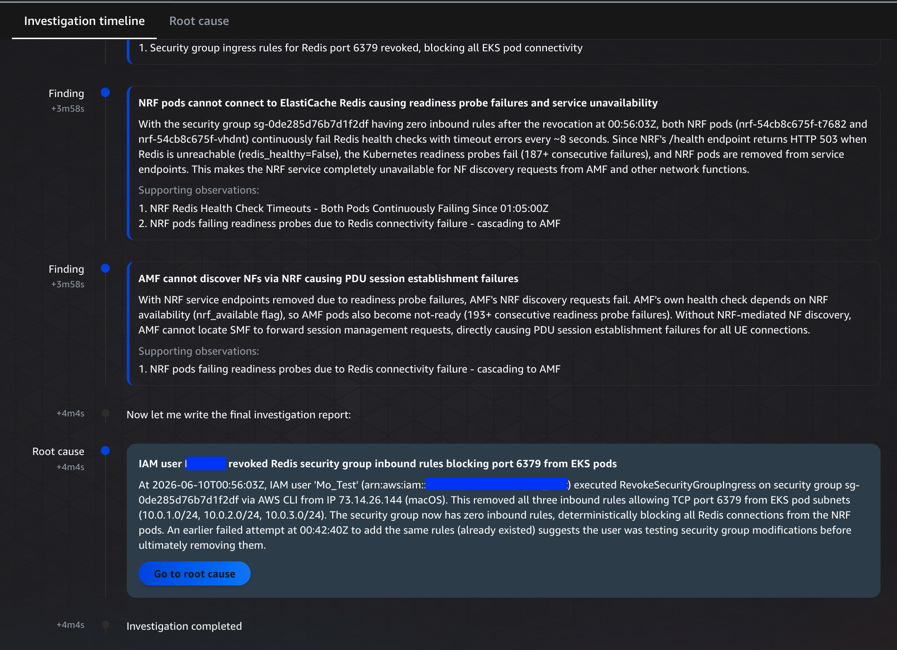
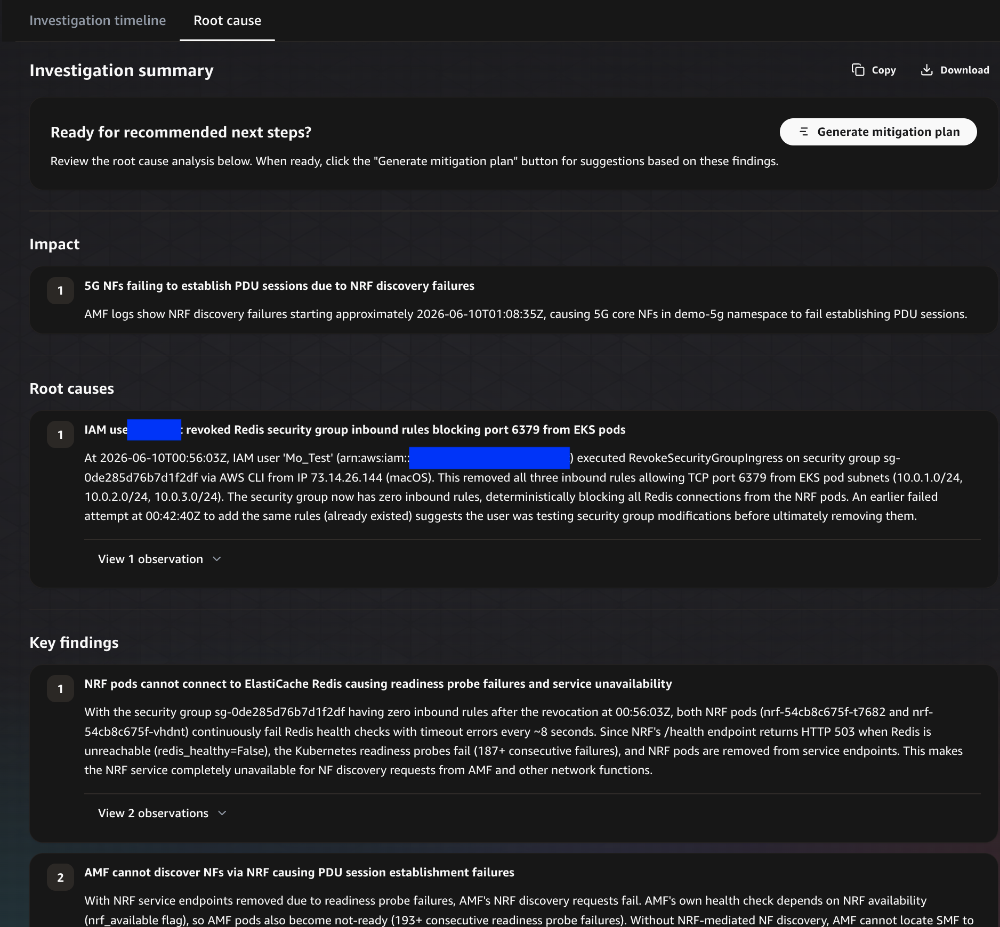

# Scenario 1: Who Changed the Security Group?

## Story

During a routine security audit, a team member tightened Security Group rules on the ElastiCache Redis cluster — accidentally blocking the pod subnet CIDRs. The NRF (Network Repository Function) loses its Redis backend, causing a cascade failure across the entire 5G core. In a production network, this would be a **total service outage** — no subscriber can register, establish data sessions, or hand over between cells.

## Failure Chain

```
SG rule revoked → NRF can't reach Redis → NRF service registry offline
→ AMF/SMF Nnrf discovery fails (no peer resolution)
→ N11 (AMF→SMF) session setup impossible
→ PDU session establishment fails for ALL subscribers
→ No UE can attach to network or establish data bearer
```

## Impact (Telco Terms)

- **Affected:** All subscribers across all slices (S-NSSAI)
- **Symptom:** UE registration timeouts, PDU session setup rejected
- **KPI impact:** Attach Success Rate → 0%, PDU Setup Success Rate → 0%
- **Severity:** P1 — total core outage, all network services down

## Alarms Expected

| Alarm | Trigger |
|-------|---------|
| 5G-Core-NRF-Redis-Disconnected | NewConnections drops to 0 |
| 5G-Core-NF-Not-Ready | NRF service endpoints drop |
| 5G-Core-AMF-Replicas-Unavailable | Cascade — AMF health degrades |

## Run

### Inject (~30s to manifest)

```bash
./scripts-5g/scenario-1-sg-change.sh inject
```

Wait 1-2 minutes for alarms to fire.

### Observe

```bash
# NRF logs — connection refused to Redis
kubectl logs -l nf-type=nrf -n demo-5g --tail=5

# AMF logs — NRF discovery failure
kubectl logs -l nf-type=amf -n demo-5g --tail=5
```

### Agent Prompt

Paste into the DevOps Agent Space:

> The 5G core NFs in demo-5g namespace are failing to establish PDU sessions. AMF logs show NRF discovery failures starting about 1 minute ago. Investigate.

### Expected Agent Investigation Path

1. Checks AMF pod logs → sees NRF connection errors
2. Checks NRF pod logs → sees Redis "Connection refused"
3. Checks Redis node health → healthy (not a Redis issue)
4. Inspects Security Group on Redis → finds missing inbound rule for port 6379
5. Searches CloudTrail → finds the exact `RevokeSecurityGroupIngress` API call with:
   - Who: IAM user/role ARN
   - When: timestamp
   - Source IP: requester's IP
   - What: the specific CIDRs removed

### Key Demo Talking Points

- Agent correlated **infrastructure** (SG change) with **application** (pod failures)
- CloudTrail integration identified WHO made the change — critical for NOC/L2 triage
- Agent understood the NRF→Redis→cascade dependency without being told

**Agent Investigation Output:**







### Restore

```bash
./scripts-5g/scenario-1-sg-change.sh restore
```

Alarms return to OK within 1-2 minutes. NRF auto-reconnects to Redis.

## Timing

- Inject to alarm: ~1-2 min
- Agent investigation: ~2-3 min
- Total scenario: ~5 min
