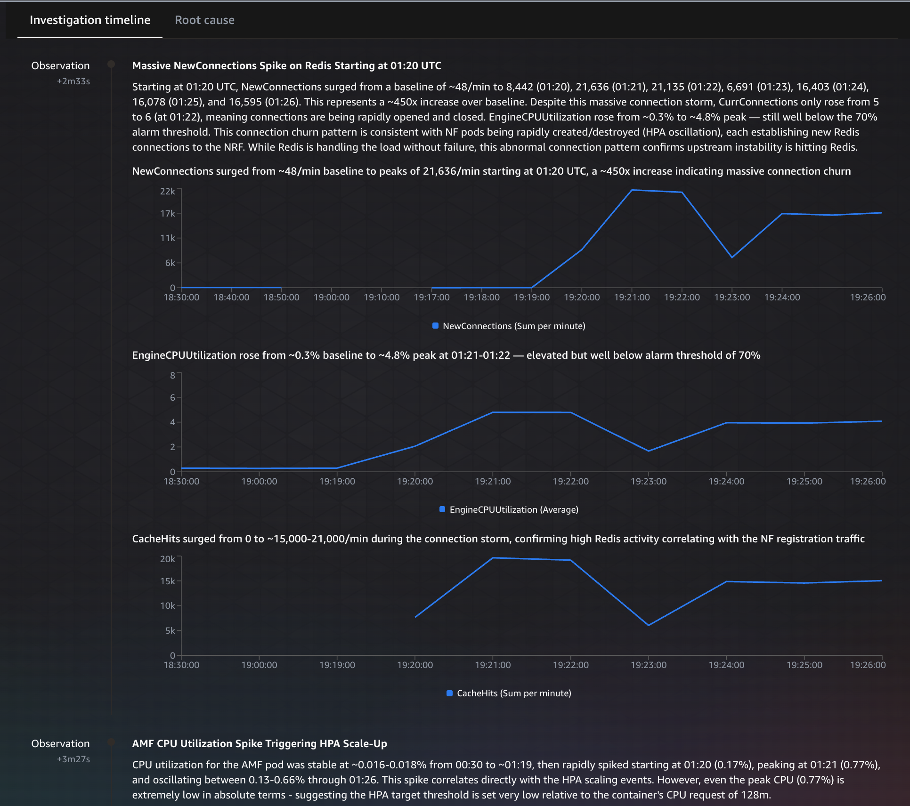
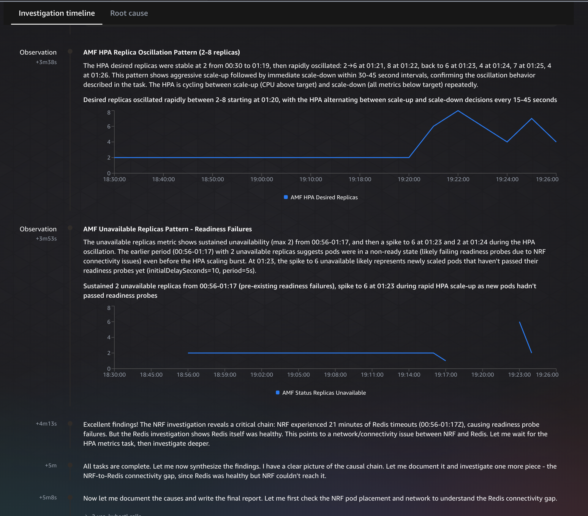
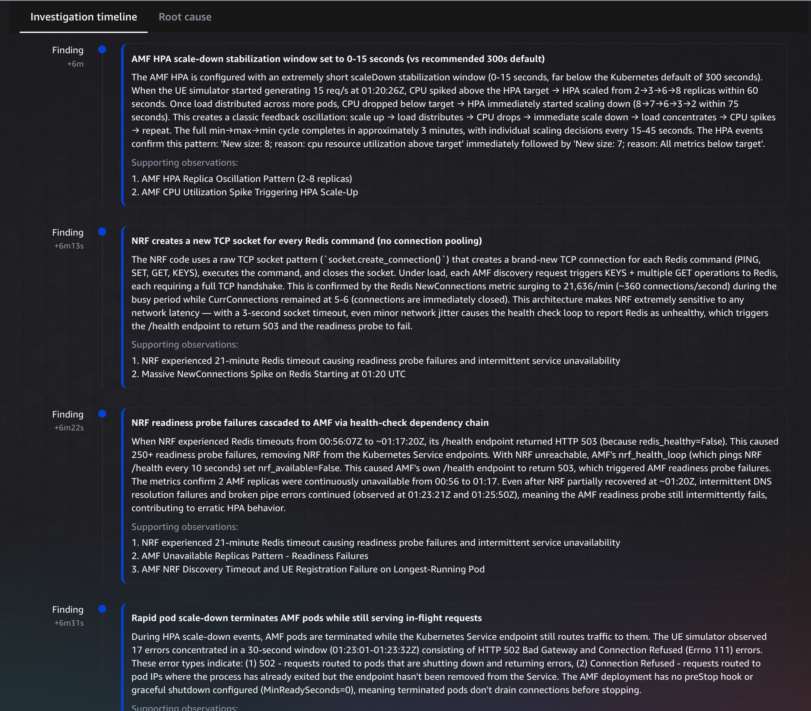

# Scenario 4: The Scaling Storm

## Story

An SRE set aggressive HPA parameters — ultra-low CPU target (15%) and zero stabilization window — to "ensure fast scaling during busy hour." This creates a feedback loop: HPA scales up aggressively, new AMF pods join and drag average CPU down, HPA scales back, remaining pods are overloaded, HPA scales up again. Each scaling cycle tears down and re-establishes NRF connections, causing a **420× Redis connection spike per oscillation** that disrupts the service registry for all NFs.

In a production network, this manifests as **intermittent subscriber failures** — the kind that are hardest to troubleshoot because the system appears healthy between oscillation cycles.

## Failure Chain

```
HPA target=15% + stabilizationWindow=0s → aggressive scale-up on busy hour load
→ New AMF pods join → average CPU drops below target → HPA scales down
→ Remaining AMF pods overloaded → CPU spikes → HPA scales up again
→ Each cycle: AMF pods terminate → NRF connections dropped → NRF Redis connection storm
→ 420× Redis NewConnections spike per oscillation cycle
→ NRF briefly unable to serve Nnrf discovery during connection storm
→ Intermittent PDU session failures (SMF/UPF can't be discovered)
→ Subscriber experiences: session drops, re-establishment delays
```

## Impact (Telco Terms)

- **Affected:** All subscribers intermittently during oscillation cycles
- **Symptom:** Sporadic PDU session setup failures, intermittent bearer drops
- **KPI impact:** PDU Setup Success Rate oscillates (95%→70%→95%→70%), Subscriber QoE degrades
- **Severity:** P3 — service degraded but not down; extremely hard to diagnose without understanding the feedback loop

## Alarms Expected

Unlike other scenarios where alarms stay in ALARM state, **Scenario 4 alarms oscillate** — they fire and recover repeatedly as the HPA cycles. This is the defining characteristic: the system looks sick → healthy → sick → healthy. In production, this is what makes it so hard to diagnose — by the time someone checks, everything looks fine.

| Alarm | Trigger | Behavior |
|-------|---------|----------|
| 5G-Core-AMF-HPA-Scaling-Storm | Desired replicas > 6 | Fires on scale-up, clears on scale-down |
| 5G-Core-AMF-Replicas-Unavailable | Unavailable > 0 | Fires during transitions (pods terminating) |
| 5G-Core-NF-Not-Ready | Running pods < 2 | Brief flickers during scale-down |
| 5G-Core-Cluster-Node-Capacity-Saturated | Node CPU ≥ 80% | Fires during up-cycles when nodes are packed |

## Run

### What You'll See

Unlike Scenarios 1-3 where the system breaks and stays broken, **Scenario 4 oscillates**. Watch the CloudWatch Alarms page — you'll see alarms fire, recover, fire again. This is confusing by design. In production, NOC engineers see the alarm clear and assume the issue resolved itself. Then it fires again 60 seconds later. This cycle repeats indefinitely until someone identifies the HPA misconfiguration.

### Inject (~2-3 min to see oscillation)

```bash
./scripts-5g/scenario-4-scaling-storm.sh inject
```

Wait 2-3 minutes for HPA oscillation to become visible. You'll see replica count swing wildly (e.g., 2→9→2→7).

### Observe

```bash
# Watch HPA oscillate in real time
kubectl get hpa amf -n demo-5g -w

# Events stream showing scaling
kubectl get events -n demo-5g --sort-by='.lastTimestamp' --watch

# Replica history
kubectl describe hpa amf -n demo-5g | tail -20
```

### Agent Prompt

> The AMF HPA in demo-5g is rapidly scaling pods up and down. We're seeing intermittent subscriber registration failures during busy hour. Investigate the scaling behavior.

### Expected Agent Investigation Path

1. Checks HPA status → sees rapid replica count changes (oscillation pattern)
2. Inspects HPA spec → identifies:
   - CPU target: 15% (too aggressive)
   - stabilizationWindowSeconds: 0 (no cooldown)
3. Correlates with metrics → shows CPU oscillating as pods join/leave
4. May identify Redis connection spike (NRF reconnection storm per cycle)
5. May check Container Insights → correlates pod scaling events with latency spikes
6. Recommends:
   - Raise CPU target to 60-70%
   - Add stabilizationWindowSeconds (300s recommended)
   - Consider custom metrics instead of CPU for network workloads

### Key Demo Talking Points

- This is the **hardest** scenario — it's a configuration mistake, not a broken component
- Agent understood the HPA feedback loop dynamics and explained the oscillation mechanism
- Connected infrastructure scaling to application impact (connection pool churn)
- Found the NRF connection pooling bug: each scale event creates 420x Redis connection spike
- Real-world: this exact scenario happens when teams set aggressive HPA targets without stabilization

**Agent Investigation Output:**





### Restore

```bash
./scripts-5g/scenario-4-scaling-storm.sh restore
```

Restores original HPA parameters (70% target, 300s stabilization). Oscillation stops within one cooldown period.

## Timing

- Inject to visible oscillation: ~2-3 min
- Agent investigation: ~6-8 min (longest scenario)
- Total scenario: ~12 min

## Advanced Follow-Up

After the agent explains the issue, try asking:

> "What would prevent this in the future? Suggest guardrails."

The agent typically recommends:
- OPA/Kyverno policy to enforce minimum stabilizationWindow
- Alerting on HPA replica count rate-of-change
- Custom metrics (connection count per pod) instead of raw CPU
